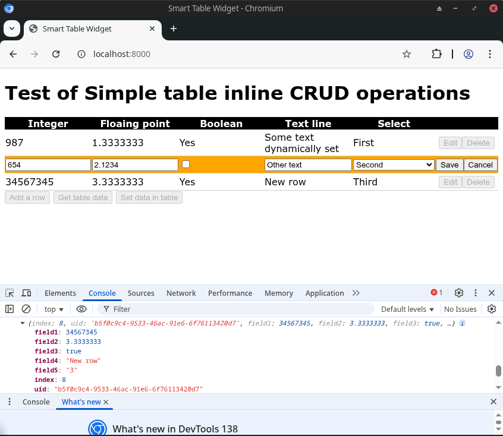

# Smart Table

A lightweight JavaScript library for creating editable HTML tables with inline CRUD (Create, Read, Update, Delete) operations.



(c) 2025 - James Hickman - www.rationalboxes.com

## Features

- Create, read, update, and delete operations on table rows
- Support for various data types:
  - Integer
  - Float
  - Boolean (checkbox)
  - Text
  - Select (dropdown)
- Custom callbacks for save and delete operations
- Configurable labels and messages
- Row ID override capability (useful for integrating with backend systems)
- Ability to dynamically populate table data

## Usage

Include the library in your HTML:

```html
<script src="./js/ediable_table.js" type="module"></script>
<link rel="stylesheet" href="css/styles.css" />
```

Create an HTML table with appropriate data attributes:

```html
<table id="smart-table">
    <thead>
        <tr>
            <th data-type="index" data-name="index">Row index</th>
            <th data-type="" data-name="uid">UUID</th>
            <th data-type="int" data-name="field1">Integer</th>
            <th data-type="float" data-name="field2">Floating point</th>
            <th data-type="bool" data-name="field3">Boolean</th>
            <th data-type="text" data-name="field4">Text line</th>
            <th data-type="select" data-name="field5">Select</th>
        </tr>
    </thead>
    <tbody>
        <!-- Table rows will be added here -->
    </tbody>
</table>
```

Initialize the table:

```javascript
import EditableTable from './js/ediable_table.js'

const table = new EditableTable(
    document.getElementById('smart-table'),
    (is_new, index, data) => {
        // Callback when a row is saved
        console.log(index);
        console.log(data);
    },
    (index) => {
        // Callback when a row is deleted
        console.log(index);
    },
    {
        "fields": {
            "field3": {
                "labels": {
                    "true": "Yes",
                    "false": "No"
                }
            },
            "field5": {
                "options": {
                    "1": "First",
                    "2": "Second",
                    "3": "Third"
                }
            }
        }
    }
);
```

## API Reference

### Constructor

```javascript
new EditableTable(element, saveCallback, deleteCallback, config)
```

- `element`: HTML table element
- `saveCallback`: Function called when a row is saved `(is_new, index, data) => {}`
- `deleteCallback`: Function called when a row is deleted `(index) => {}`
- `config`: Configuration object for field definitions and labels

### Methods

- `build_edit_buttons()`: Creates edit and delete buttons for each row
- `reset()`: Resets and empties the table
- `override_id(old_id, new_id, updates)`: Replaces row ID and optionally updates other columns
- `set_labels(edit, delete, confirmation, save, cancel, yes, no)`: Sets button labels and confirmation message
- `set_yes_no(field, yes_label, no_label)`: Sets labels for a boolean field
- `set_select_options(field, options)`: Sets options for a select field
- `add_row(row)`: Adds a row to the end of the table
- `new_row()`: Adds a new row and opens it in edit mode
- `set_rows(rows)`: Populates the table with an array of row objects
- `get_values()`: Returns an array of objects with the table data
- `set_edit_callbacks(startCallback, endCallback)`: Sets callbacks for edit mode start and end

## Example

See `index.html` for a complete example implementation that demonstrates all features of the Smart Table library.

## Styling

The library comes with basic styling in `styles.css`. You can customize the appearance by modifying this file or overriding the styles in your own CSS.

## Plugin System

Smart Table supports custom field types through a plugin system. Plugins allow you to extend the functionality of table fields beyond the built-in types (int, float, bool, text, select, etc.).

### Creating Plugins

To create a custom plugin, extend the `Plugin` base class and implement the required methods:

- `createEditElement(fieldName, currentValue)` - Create the form element for editing mode
- `decodeValue(cellElement)` - Extract the data value from a display cell
- `saveValue(editCellElement, displayCellElement)` - Save the edited value back to display mode
- `renderDisplay(value)` - Render the display mode HTML for a value

For detailed instructions, see the [Plugin Development Guide](docs/PLUGIN_DEVELOPMENT.md).

### File Plugin

The File Plugin enables file upload and download functionality. Users can upload files to a server and store references to them in table cells, which are displayed as downloadable links.

For detailed usage instructions, see the [File Plugin Documentation](docs/FILE_PLUGIN.md).

## License

This project is licensed under the MIT License - see the [LICENSE](LICENSE) file for details.